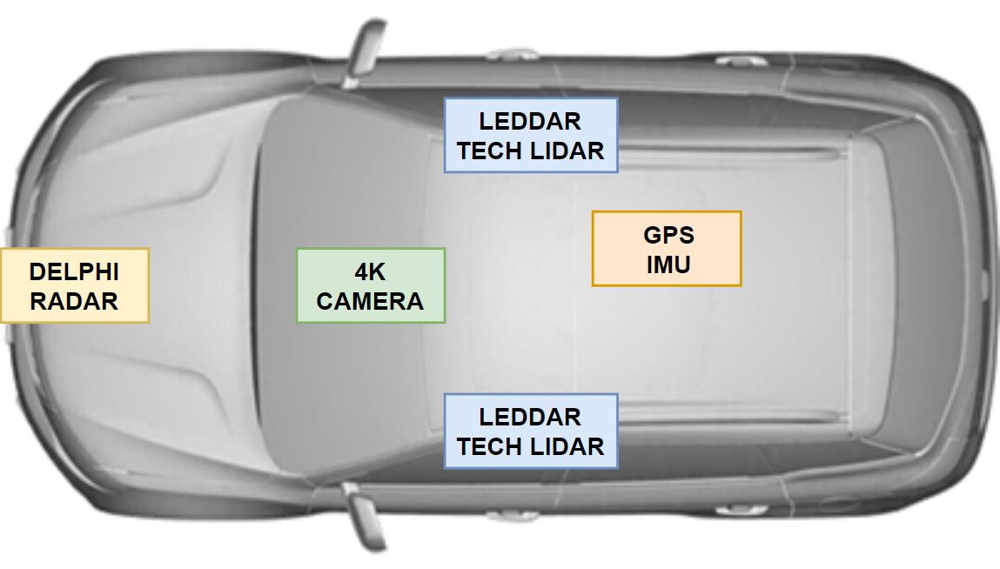

# Data Definitions and Sensor Layout

## Sensor Layout

## Data Definitions

The table below provides the definitions of the data available on the `honda-hackathon1` table.

`N` data type is numerical. `S` data type is string.

| Column Name              | Basic Description                                         | Data Type | Example Value                                                              | Unit                | Notes                                                                                                                                                     |
|--------------------------|-----------------------------------------------------------|-----------|----------------------------------------------------------------------------|---------------------|-----------------------------------------------------------------------------------------------------------------------------------------------------------|
| driveid                  | ID Generated by datetime stamp to specifiy drive instance | N         | 20181127151525                                                             | n/a                 | One drive ID for many rows                                                                                                                                |
| Driver_Video             | Filename referencing cabin facing video file.             | S         | Recfile P3 Edge 20181127 151525 Webcam Driver Outputiplimage.m4v           | n/a                 | File available on S3 bucket                                                                                                                               |
| Exterior_Video           | Filename referencing front facing video file.             | S         | Recfile P3 Edge 20181127 151525 Webcam Logitech Forward Outputiplimage.m4v | n/a                 | File available on S3 bucket                                                                                                                               |
| File_Name                | Filename referencing Dspace REC file.                     | S         | RecFile_P3_Edge_20181127_151525.rec                                        | n/a                 | File available on S3 bucket                                                                                                                               |
| Weather_Conditions       | List of weather conditions during drive instance.         | S         | \"Dry, cloudy, light traffic\"                                             | n/a                 |                                                                                                                                                           |
| logtime                  | Elapsed time from start of drive instance                 | N         | 1408417                                                                    | Microseconds        |                                                                                                                                                           |
| GPS_Lat                  | Location Latitude Coordinate at current timestamp         | N         | 42.48629379                                                                | Degrees             |                                                                                                                                                           |
| GPS_Lon                  | Location Longitude Coordinate at current timestamp        | N         | -83.29524994                                                               | Degrees             |                                                                                                                                                           |
| GPS_Alt                  | Location Altitude Coordinate at current timestamp         | N         | 210.3000031                                                                | Meters              | 0 is sea level                                                                                                                                            |
| IMU_ACC_X                | Latitudinal Acceleration                                  | N         | 0.00144                                                                    | g                   |                                                                                                                                                           |
| IMU_ACC_Y                | Longitudinal Acceleration                                 | N         | -0.079010002                                                               | g                   |                                                                                                                                                           |
| IMU_ACC_Z                | Verticle Acceleration                                     | N         | 1.003679991                                                                | g                   |                                                                                                                                                           |
| IMU_ROLL                 | Vehicle roll amount                                       | N         | -0.886229992                                                               | Degrees per second  |                                                                                                                                                           |
| IMU_PITCH                | Vehicle Pitch amount                                      | N         | 0.495990008                                                                | Degrees per second  |                                                                                                                                                           |
| IMU_YAW                  | Vehicle Yaw                                               | N         | -0.0973                                                                    | Degrees per second  |                                                                                                                                                           |
| CAN_VEHICLE_SPEED        | Vehicle Speed                                             | N         | 3.140000105                                                                | Kilometers per hour | Range: 0 to 655.35                                                                                                                                        |
| CAN_STEERING_WHEEL_ANGLE | Vehicle steering wheel angle in degrees.                  | N         | -0.200000003                                                               | Degrees             | Range: -1600 to 1676.7                                                                                                                                    |
| CAN_GEAR_POSITION        | Vehicle gear position                                     | N         | 3                                                                          | n/a                 | byte 1 upper nibble (raw data)  0x0y -- Park -- 0b000  0x2y -- Reverse  -- 0b001  0x4y -- Neutral  -- 0b010  0x6y -- Drive  -- 0b011  0x8y -- Sports  -- 0b100 |
| CAN_TURN_SIGNAL_LEFT     | Left turn signal of vehicle                               | N         | 0                                                                          | n/a                 | xx00: off  xx01: left turn signal on  xx02: right turn signal on                                                                                    |
| CAN_TURN_SIGNAL_RIGHT    | Right turn signal of vehicle                              | N         | 0                                                                          | n/a                 | xx00: off  xx01: left turn signal on  xx02: right turn signal on                                                                                    |
| LRR_RANGE_0              | Range to object 0                                         | N         | 15.19999981                                                                | Meters              | Radar tracking up to 64 objects simultaneously.                                                                                                           |
| LRR_RANGE_1              | Range to object 1                                         | N         | 0                                                                          | Meters              | Radar tracking up to 64 objects simultaneously.                                                                                                           |
| LRR_RANGE_2              | Range to object 2                                         | N         | 56.79999924                                                                | Meters              | Radar tracking up to 64 objects simultaneously.                                                                                                           |
| LRR_RANGE_3              | Range to object 3                                         | N         | 0                                                                          | Meters              | Radar tracking up to 64 objects simultaneously.                                                                                                           |
| LRR_RANGE_4              | Range to object 4                                         | N         | 0                                                                          | Meters              | Radar tracking up to 64 objects simultaneously.                                                                                                           |
| LRR_RANGE_5              | Range to object 5                                         | N         | 0                                                                          | Meters              | Radar tracking up to 64 objects simultaneously.                                                                                                           |
| LRR_RANGE_6              | Range to object 6                                         | N         | 0                                                                          | Meters              | Radar tracking up to 64 objects simultaneously.                                                                                                           |
| LRR_RANGE_7              | Range to object 7                                         | N         | 0                                                                          | Meters              | Radar tracking up to 64 objects simultaneously.                                                                                                           |
| LRR_RANGE_8              | Range to object 8                                         | N         | 0                                                                          | Meters              | Radar tracking up to 64 objects simultaneously.                                                                                                           |
| LRR_RANGE_9              | Range to object 9                                         | N         | 0                                                                          | Meters              | Radar tracking up to 64 objects simultaneously.                                                                                                           |
| LRR_RANGE_10             | Range to object 10                                        | N         | 0                                                                          | Meters              | Radar tracking up to 64 objects simultaneously.                                                                                                           |
| LRR_RANGE_11             | Range to object 11                                        | N         | 0                                                                          | Meters              | Radar tracking up to 64 objects simultaneously.                                                                                                           |
| LRR_RANGE_12             | Range to object 12                                        | N         | 0                                                                          | Meters              | Radar tracking up to 64 objects simultaneously.                                                                                                           |
| LRR_RANGE_13             | Range to object 13                                        | N         | 0                                                                          | Meters              | Radar tracking up to 64 objects simultaneously.                                                                                                           |
| LRR_RANGE_14             | Range to object 14                                        | N         | 85.90000153                                                                | Meters              | Radar tracking up to 64 objects simultaneously.                                                                                                           |
| LRR_RANGE_15             | Range to object 15                                        | N         | 0                                                                          | Meters              | Radar tracking up to 64 objects simultaneously.                                                                                                           |
| LRR_RANGE_16             | Range to object 16                                        | N         | 0                                                                          | Meters              | Radar tracking up to 64 objects simultaneously.                                                                                                           |
| LRR_RANGE_17             | Range to object 17                                        | N         | 0                                                                          | Meters              | Radar tracking up to 64 objects simultaneously.                                                                                                           |
| LRR_RANGE_18             | Range to object 18                                        | N         | 0                                                                          | Meters              | Radar tracking up to 64 objects simultaneously.                                                                                                           |
| LRR_RANGE_19             | Range to object 19                                        | N         | 0                                                                          | Meters              | Radar tracking up to 64 objects simultaneously.                                                                                                           |
| LRR_RANGE_20             | Range to object 20                                        | N         | 0                                                                          | Meters              | Radar tracking up to 64 objects simultaneously.                                                                                                           |
| LRR_RANGE_21             | Range to object 21                                        | N         | 0                                                                          | Meters              | Radar tracking up to 64 objects simultaneously.                                                                                                           |
| LRR_RANGE_22             | Range to object 22                                        | N         | 0                                                                          | Meters              | Radar tracking up to 64 objects simultaneously.                                                                                                           |
| LRR_RANGE_23             | Range to object 23                                        | N         | 0                                                                          | Meters              | Radar tracking up to 64 objects simultaneously.                                                                                                           |
| LRR_RANGE_24             | Range to object 24                                        | N         | 0                                                                          | Meters              | Radar tracking up to 64 objects simultaneously.                                                                                                           |
| LRR_RANGE_25             | Range to object 25                                        | N         | 0                                                                          | Meters              | Radar tracking up to 64 objects simultaneously.                                                                                                           |
| LRR_RANGE_26             | Range to object 26                                        | N         | 0                                                                          | Meters              | Radar tracking up to 64 objects simultaneously.                                                                                                           |
| LRR_RANGE_27             | Range to object 27                                        | N         | 0                                                                          | Meters              | Radar tracking up to 64 objects simultaneously.                                                                                                           |
| LRR_RANGE_28             | Range to object 28                                        | N         | 0                                                                          | Meters              | Radar tracking up to 64 objects simultaneously.                                                                                                           |
| LRR_RANGE_29             | Range to object 29                                        | N         | 0                                                                          | Meters              | Radar tracking up to 64 objects simultaneously.                                                                                                           |
| LRR_RANGE_30             | Range to object 30                                        | N         | 0                                                                          | Meters              | Radar tracking up to 64 objects simultaneously.                                                                                                           |
| LRR_RANGE_31             | Range to object 31                                        | N         | 0                                                                          | Meters              | Radar tracking up to 64 objects simultaneously.                                                                                                           |
| LRR_RANGE_32             | Range to object 32                                        | N         | 0                                                                          | Meters              | Radar tracking up to 64 objects simultaneously.                                                                                                           |
| LRR_RANGE_33             | Range to object 33                                        | N         | 0                                                                          | Meters              | Radar tracking up to 64 objects simultaneously.                                                                                                           |
| LRR_RANGE_34             | Range to object 34                                        | N         | 0                                                                          | Meters              | Radar tracking up to 64 objects simultaneously.                                                                                                           |
| LRR_RANGE_35             | Range to object 35                                        | N         | 0                                                                          | Meters              | Radar tracking up to 64 objects simultaneously.                                                                                                           |
| LRR_RANGE_36             | Range to object 36                                        | N         | 0                                                                          | Meters              | Radar tracking up to 64 objects simultaneously.                                                                                                           |
| LRR_RANGE_37             | Range to object 37                                        | N         | 0                                                                          | Meters              | Radar tracking up to 64 objects simultaneously.                                                                                                           |
| LRR_RANGE_38             | Range to object 38                                        | N         | 0                                                                          | Meters              | Radar tracking up to 64 objects simultaneously.                                                                                                           |
| LRR_RANGE_39             | Range to object 39                                        | N         | 0                                                                          | Meters              | Radar tracking up to 64 objects simultaneously.                                                                                                           |
| LRR_RANGE_40             | Range to object 40                                        | N         | 0                                                                          | Meters              | Radar tracking up to 64 objects simultaneously.                                                                                                           |
| LRR_RANGE_41             | Range to object 41                                        | N         | 0                                                                          | Meters              | Radar tracking up to 64 objects simultaneously.                                                                                                           |
| LRR_RANGE_42             | Range to object 42                                        | N         | 0                                                                          | Meters              | Radar tracking up to 64 objects simultaneously.                                                                                                           |
| LRR_RANGE_43             | Range to object 43                                        | N         | 0                                                                          | Meters              | Radar tracking up to 64 objects simultaneously.                                                                                                           |
| LRR_RANGE_44             | Range to object 44                                        | N         | 0                                                                          | Meters              | Radar tracking up to 64 objects simultaneously.                                                                                                           |
| LRR_RANGE_45             | Range to object 45                                        | N         | 0                                                                          | Meters              | Radar tracking up to 64 objects simultaneously.                                                                                                           |
| LRR_RANGE_46             | Range to object 46                                        | N         | 0                                                                          | Meters              | Radar tracking up to 64 objects simultaneously.                                                                                                           |
| LRR_RANGE_47             | Range to object 47                                        | N         | 0                                                                          | Meters              | Radar tracking up to 64 objects simultaneously.                                                                                                           |
| LRR_RANGE_48             | Range to object 48                                        | N         | 0                                                                          | Meters              | Radar tracking up to 64 objects simultaneously.                                                                                                           |
| LRR_RANGE_49             | Range to object 49                                        | N         | 15.30000019                                                                | Meters              | Radar tracking up to 64 objects simultaneously.                                                                                                           |
| LRR_RANGE_50             | Range to object 50                                        | N         | 0                                                                          | Meters              | Radar tracking up to 64 objects simultaneously.                                                                                                           |
| LRR_RANGE_51             | Range to object 51                                        | N         | 0                                                                          | Meters              | Radar tracking up to 64 objects simultaneously.                                                                                                           |
| LRR_RANGE_52             | Range to object 52                                        | N         | 0                                                                          | Meters              | Radar tracking up to 64 objects simultaneously.                                                                                                           |
| LRR_RANGE_53             | Range to object 53                                        | N         | 0                                                                          | Meters              | Radar tracking up to 64 objects simultaneously.                                                                                                           |
| LRR_RANGE_54             | Range to object 54                                        | N         | 0                                                                          | Meters              | Radar tracking up to 64 objects simultaneously.                                                                                                           |
| LRR_RANGE_55             | Range to object 55                                        | N         | 0                                                                          | Meters              | Radar tracking up to 64 objects simultaneously.                                                                                                           |
| LRR_RANGE_56             | Range to object 56                                        | N         | 0                                                                          | Meters              | Radar tracking up to 64 objects simultaneously.                                                                                                           |
| LRR_RANGE_57             | Range to object 57                                        | N         | 0                                                                          | Meters              | Radar tracking up to 64 objects simultaneously.                                                                                                           |
| LRR_RANGE_58             | Range to object 58                                        | N         | 0                                                                          | Meters              | Radar tracking up to 64 objects simultaneously.                                                                                                           |
| LRR_RANGE_59             | Range to object 59                                        | N         | 0                                                                          | Meters              | Radar tracking up to 64 objects simultaneously.                                                                                                           |
| LRR_RANGE_60             | Range to object 60                                        | N         | 0                                                                          | Meters              | Radar tracking up to 64 objects simultaneously.                                                                                                           |
| LRR_RANGE_61             | Range to object 61                                        | N         | 0                                                                          | Meters              | Radar tracking up to 64 objects simultaneously.                                                                                                           |
| LRR_RANGE_62             | Range to object 62                                        | N         | 0                                                                          | Meters              | Radar tracking up to 64 objects simultaneously.                                                                                                           |
| LRR_RANGE_63             | Range to object 63                                        | N         | 15.30000019                                                                | Meters              | Radar tracking up to 64 objects simultaneously.                                                                                                           |
| LRR_ANGLE_0              | Angle to object 0                                         | N         | 0                                                                          | Radians             | Radar tracking up to 64 objects simultaneously.                                                                                                           |
| LRR_ANGLE_1              | Angle to object 1                                         | N         | 0                                                                          | Radians             | Radar tracking up to 64 objects simultaneously.                                                                                                           |
| LRR_ANGLE_2              | Angle to object 2                                         | N         | 0                                                                          | Radians             | Radar tracking up to 64 objects simultaneously.                                                                                                           |
| LRR_ANGLE_3              | Angle to object 3                                         | N         | 2.299999952                                                                | Radians             | Radar tracking up to 64 objects simultaneously.                                                                                                           |
| LRR_ANGLE_4              | Angle to object 4                                         | N         | 0                                                                          | Radians             | Radar tracking up to 64 objects simultaneously.                                                                                                           |
| LRR_ANGLE_5              | Angle to object 5                                         | N         | 0                                                                          | Radians             | Radar tracking up to 64 objects simultaneously.                                                                                                           |
| LRR_ANGLE_6              | Angle to object 6                                         | N         | 0                                                                          | Radians             | Radar tracking up to 64 objects simultaneously.                                                                                                           |
| LRR_ANGLE_7              | Angle to object 7                                         | N         | 0                                                                          | Radians             | Radar tracking up to 64 objects simultaneously.                                                                                                           |
| LRR_ANGLE_8              | Angle to object 8                                         | N         | 0                                                                          | Radians             | Radar tracking up to 64 objects simultaneously.                                                                                                           |
| LRR_ANGLE_9              | Angle to object 9                                         | N         | 0                                                                          | Radians             | Radar tracking up to 64 objects simultaneously.                                                                                                           |
| LRR_ANGLE_10             | Angle to object 10                                        | N         | 10.80000019                                                                | Radians             | Radar tracking up to 64 objects simultaneously.                                                                                                           |
| LRR_ANGLE_11             | Angle to object 11                                        | N         | 0                                                                          | Radians             | Radar tracking up to 64 objects simultaneously.                                                                                                           |
| LRR_ANGLE_12             | Angle to object 12                                        | N         | 0                                                                          | Radians             | Radar tracking up to 64 objects simultaneously.                                                                                                           |
| LRR_ANGLE_13             | Angle to object 13                                        | N         | 0                                                                          | Radians             | Radar tracking up to 64 objects simultaneously.                                                                                                           |
| LRR_ANGLE_14             | Angle to object 14                                        | N         | 0                                                                          | Radians             | Radar tracking up to 64 objects simultaneously.                                                                                                           |
| LRR_ANGLE_15             | Angle to object 15                                        | N         | 0                                                                          | Radians             | Radar tracking up to 64 objects simultaneously.                                                                                                           |
| LRR_ANGLE_16             | Angle to object 16                                        | N         | 0                                                                          | Radians             | Radar tracking up to 64 objects simultaneously.                                                                                                           |
| LRR_ANGLE_17             | Angle to object 17                                        | N         | 0                                                                          | Radians             | Radar tracking up to 64 objects simultaneously.                                                                                                           |
| LRR_ANGLE_18             | Angle to object 18                                        | N         | 6.300000191                                                                | Radians             | Radar tracking up to 64 objects simultaneously.                                                                                                           |
| LRR_ANGLE_19             | Angle to object 19                                        | N         | 0                                                                          | Radians             | Radar tracking up to 64 objects simultaneously.                                                                                                           |
| LRR_ANGLE_20             | Angle to object 20                                        | N         | 0                                                                          | Radians             | Radar tracking up to 64 objects simultaneously.                                                                                                           |
| LRR_ANGLE_21             | Angle to object 21                                        | N         | 0                                                                          | Radians             | Radar tracking up to 64 objects simultaneously.                                                                                                           |
| LRR_ANGLE_22             | Angle to object 22                                        | N         | 0                                                                          | Radians             | Radar tracking up to 64 objects simultaneously.                                                                                                           |
| LRR_ANGLE_23             | Angle to object 23                                        | N         | 0                                                                          | Radians             | Radar tracking up to 64 objects simultaneously.                                                                                                           |
| LRR_ANGLE_24             | Angle to object 24                                        | N         | 0                                                                          | Radians             | Radar tracking up to 64 objects simultaneously.                                                                                                           |
| LRR_ANGLE_25             | Angle to object 25                                        | N         | 0                                                                          | Radians             | Radar tracking up to 64 objects simultaneously.                                                                                                           |
| LRR_ANGLE_26             | Angle to object 26                                        | N         | 0                                                                          | Radians             | Radar tracking up to 64 objects simultaneously.                                                                                                           |
| LRR_ANGLE_27             | Angle to object 27                                        | N         | 0                                                                          | Radians             | Radar tracking up to 64 objects simultaneously.                                                                                                           |
| LRR_ANGLE_28             | Angle to object 28                                        | N         | 0                                                                          | Radians             | Radar tracking up to 64 objects simultaneously.                                                                                                           |
| LRR_ANGLE_29             | Angle to object 29                                        | N         | 0                                                                          | Radians             | Radar tracking up to 64 objects simultaneously.                                                                                                           |
| LRR_ANGLE_30             | Angle to object 30                                        | N         | 0                                                                          | Radians             | Radar tracking up to 64 objects simultaneously.                                                                                                           |
| LRR_ANGLE_31             | Angle to object 31                                        | N         | 0                                                                          | Radians             | Radar tracking up to 64 objects simultaneously.                                                                                                           |
| LRR_ANGLE_32             | Angle to object 32                                        | N         | 0                                                                          | Radians             | Radar tracking up to 64 objects simultaneously.                                                                                                           |
| LRR_ANGLE_33             | Angle to object 33                                        | N         | 0                                                                          | Radians             | Radar tracking up to 64 objects simultaneously.                                                                                                           |
| LRR_ANGLE_34             | Angle to object 34                                        | N         | 0                                                                          | Radians             | Radar tracking up to 64 objects simultaneously.                                                                                                           |
| LRR_ANGLE_35             | Angle to object 35                                        | N         | 14.30000019                                                                | Radians             | Radar tracking up to 64 objects simultaneously.                                                                                                           |
| LRR_ANGLE_36             | Angle to object 36                                        | N         | 0                                                                          | Radians             | Radar tracking up to 64 objects simultaneously.                                                                                                           |
| LRR_ANGLE_37             | Angle to object 37                                        | N         | 0                                                                          | Radians             | Radar tracking up to 64 objects simultaneously.                                                                                                           |
| LRR_ANGLE_38             | Angle to object 38                                        | N         | 0                                                                          | Radians             | Radar tracking up to 64 objects simultaneously.                                                                                                           |
| LRR_ANGLE_39             | Angle to object 39                                        | N         | 0                                                                          | Radians             | Radar tracking up to 64 objects simultaneously.                                                                                                           |
| LRR_ANGLE_40             | Angle to object 40                                        | N         | 0                                                                          | Radians             | Radar tracking up to 64 objects simultaneously.                                                                                                           |
| LRR_ANGLE_41             | Angle to object 41                                        | N         | 0                                                                          | Radians             | Radar tracking up to 64 objects simultaneously.                                                                                                           |
| LRR_ANGLE_42             | Angle to object 42                                        | N         | 0                                                                          | Radians             | Radar tracking up to 64 objects simultaneously.                                                                                                           |
| LRR_ANGLE_43             | Angle to object 43                                        | N         | 0                                                                          | Radians             | Radar tracking up to 64 objects simultaneously.                                                                                                           |
| LRR_ANGLE_44             | Angle to object 44                                        | N         | 0                                                                          | Radians             | Radar tracking up to 64 objects simultaneously.                                                                                                           |
| LRR_ANGLE_45             | Angle to object 45                                        | N         | 0                                                                          | Radians             | Radar tracking up to 64 objects simultaneously.                                                                                                           |
| LRR_ANGLE_46             | Angle to object 46                                        | N         | -5.599999905                                                               | Radians             | Radar tracking up to 64 objects simultaneously.                                                                                                           |
| LRR_ANGLE_47             | Angle to object 47                                        | N         | 0                                                                          | Radians             | Radar tracking up to 64 objects simultaneously.                                                                                                           |
| LRR_ANGLE_48             | Angle to object 48                                        | N         | 0                                                                          | Radians             | Radar tracking up to 64 objects simultaneously.                                                                                                           |
| LRR_ANGLE_49             | Angle to object 49                                        | N         | 0                                                                          | Radians             | Radar tracking up to 64 objects simultaneously.                                                                                                           |
| LRR_ANGLE_50             | Angle to object 50                                        | N         | 0                                                                          | Radians             | Radar tracking up to 64 objects simultaneously.                                                                                                           |
| LRR_ANGLE_51             | Angle to object 51                                        | N         | 0                                                                          | Radians             | Radar tracking up to 64 objects simultaneously.                                                                                                           |
| LRR_ANGLE_52             | Angle to object 52                                        | N         | 0                                                                          | Radians             | Radar tracking up to 64 objects simultaneously.                                                                                                           |
| LRR_ANGLE_53             | Angle to object 53                                        | N         | 0                                                                          | Radians             | Radar tracking up to 64 objects simultaneously.                                                                                                           |
| LRR_ANGLE_54             | Angle to object 54                                        | N         | 0                                                                          | Radians             | Radar tracking up to 64 objects simultaneously.                                                                                                           |
| LRR_ANGLE_55             | Angle to object 55                                        | N         | 4.800000191                                                                | Radians             | Radar tracking up to 64 objects simultaneously.                                                                                                           |
| LRR_ANGLE_56             | Angle to object 56                                        | N         | 0                                                                          | Radians             | Radar tracking up to 64 objects simultaneously.                                                                                                           |
| LRR_ANGLE_57             | Angle to object 57                                        | N         | 0                                                                          | Radians             | Radar tracking up to 64 objects simultaneously.                                                                                                           |
| LRR_ANGLE_58             | Angle to object 58                                        | N         | 0                                                                          | Radians             | Radar tracking up to 64 objects simultaneously.                                                                                                           |
| LRR_ANGLE_59             | Angle to object 59                                        | N         | 0                                                                          | Radians             | Radar tracking up to 64 objects simultaneously.                                                                                                           |
| LRR_ANGLE_60             | Angle to object 60                                        | N         | 0                                                                          | Radians             | Radar tracking up to 64 objects simultaneously.                                                                                                           |
| LRR_ANGLE_61             | Angle to object 61                                        | N         | 0                                                                          | Radians             | Radar tracking up to 64 objects simultaneously.                                                                                                           |
| LRR_ANGLE_62             | Angle to object 62                                        | N         | 0                                                                          | Radians             | Radar tracking up to 64 objects simultaneously.                                                                                                           |
| LRR_ANGLE_63             | Angle to object 63                                        | N         | 3.099999905                                                                | Radians             | Radar tracking up to 64 objects simultaneously.                                                                                                           |
| LEDDAR_LEFT_0            | Distance to object within segment 0                       | N         | 816                                                                        | Centimeters         | Leddar brand solid state LiDAR sensor.                                                                                                                    |
| LEDDAR_LEFT_1            | Distance to object within segment 1                       | N         | 2113                                                                       | Centimeters         | Leddar brand solid state LiDAR sensor.                                                                                                                    |
| LEDDAR_LEFT_2            | Distance to object within segment 2                       | N         | 805                                                                        | Centimeters         | Leddar brand solid state LiDAR sensor.                                                                                                                    |
| LEDDAR_LEFT_3            | Distance to object within segment 3                       | N         | 2305                                                                       | Centimeters         | Leddar brand solid state LiDAR sensor.                                                                                                                    |
| LEDDAR_LEFT_4            | Distance to object within segment 4                       | N         | 840                                                                        | Centimeters         | Leddar brand solid state LiDAR sensor.                                                                                                                    |
| LEDDAR_LEFT_5            | Distance to object within segment 5                       | N         | 2561                                                                       | Centimeters         | Leddar brand solid state LiDAR sensor.                                                                                                                    |
| LEDDAR_LEFT_6            | Distance to object within segment 6                       | N         | 868                                                                        | Centimeters         | Leddar brand solid state LiDAR sensor.                                                                                                                    |
| LEDDAR_LEFT_7            | Distance to object within segment 7                       | N         | 2881                                                                       | Centimeters         | Leddar brand solid state LiDAR sensor.                                                                                                                    |
| LEDDAR_LEFT_8            | Distance to object within segment 8                       | N         | 894                                                                        | Centimeters         | Leddar brand solid state LiDAR sensor.                                                                                                                    |
| LEDDAR_LEFT_9            | Distance to object within segment 9                       | N         | 3137                                                                       | Centimeters         | Leddar brand solid state LiDAR sensor.                                                                                                                    |
| LEDDAR_LEFT_10           | Distance to object within segment 10                      | N         | 909                                                                        | Centimeters         | Leddar brand solid state LiDAR sensor.                                                                                                                    |
| LEDDAR_LEFT_11           | Distance to object within segment 11                      | N         | 3393                                                                       | Centimeters         | Leddar brand solid state LiDAR sensor.                                                                                                                    |
| LEDDAR_LEFT_12           | Distance to object within segment 12                      | N         | 904                                                                        | Centimeters         | Leddar brand solid state LiDAR sensor.                                                                                                                    |
| LEDDAR_LEFT_13           | Distance to object within segment 13                      | N         | 3649                                                                       | Centimeters         | Leddar brand solid state LiDAR sensor.                                                                                                                    |
| LEDDAR_LEFT_14           | Distance to object within segment 14                      | N         | 957                                                                        | Centimeters         | Leddar brand solid state LiDAR sensor.                                                                                                                    |
| LEDDAR_LEFT_15           | Distance to object within segment 15                      | N         | 3905                                                                       | Centimeters         | Leddar brand solid state LiDAR sensor.                                                                                                                    |
| LEDDAR_RIGHT_0           | Distance to object within segment 0                       | N         | 808                                                                        | Centimeters         | Leddar brand solid state LiDAR sensor.                                                                                                                    |
| LEDDAR_RIGHT_1           | Distance to object within segment 1                       | N         | 1                                                                          | Centimeters         | Leddar brand solid state LiDAR sensor.                                                                                                                    |
| LEDDAR_RIGHT_2           | Distance to object within segment 2                       | N         | 828                                                                        | Centimeters         | Leddar brand solid state LiDAR sensor.                                                                                                                    |
| LEDDAR_RIGHT_3           | Distance to object within segment 3                       | N         | 257                                                                        | Centimeters         | Leddar brand solid state LiDAR sensor.                                                                                                                    |
| LEDDAR_RIGHT_4           | Distance to object within segment 4                       | N         | 850                                                                        | Centimeters         | Leddar brand solid state LiDAR sensor.                                                                                                                    |
| LEDDAR_RIGHT_5           | Distance to object within segment 5                       | N         | 513                                                                        | Centimeters         | Leddar brand solid state LiDAR sensor.                                                                                                                    |
| LEDDAR_RIGHT_6           | Distance to object within segment 6                       | N         | 873                                                                        | Centimeters         | Leddar brand solid state LiDAR sensor.                                                                                                                    |
| LEDDAR_RIGHT_7           | Distance to object within segment 7                       | N         | 769                                                                        | Centimeters         | Leddar brand solid state LiDAR sensor.                                                                                                                    |
| LEDDAR_RIGHT_8           | Distance to object within segment 8                       | N         | 891                                                                        | Centimeters         | Leddar brand solid state LiDAR sensor.                                                                                                                    |
| LEDDAR_RIGHT_9           | Distance to object within segment 9                       | N         | 1025                                                                       | Centimeters         | Leddar brand solid state LiDAR sensor.                                                                                                                    |
| LEDDAR_RIGHT_10          | Distance to object within segment 10                      | N         | 875                                                                        | Centimeters         | Leddar brand solid state LiDAR sensor.                                                                                                                    |
| LEDDAR_RIGHT_11          | Distance to object within segment 11                      | N         | 1281                                                                       | Centimeters         | Leddar brand solid state LiDAR sensor.                                                                                                                    |
| LEDDAR_RIGHT_12          | Distance to object within segment 12                      | N         | 804                                                                        | Centimeters         | Leddar brand solid state LiDAR sensor.                                                                                                                    |
| LEDDAR_RIGHT_13          | Distance to object within segment 13                      | N         | 1537                                                                       | Centimeters         | Leddar brand solid state LiDAR sensor.                                                                                                                    |
| LEDDAR_RIGHT_14          | Distance to object within segment 14                      | N         | 850                                                                        | Centimeters         | Leddar brand solid state LiDAR sensor.                                                                                                                    |
| LEDDAR_RIGHT_15          | Distance to object within segment 15                      | N         | 1793                                                                       | Centimeters         | Leddar brand solid state LiDAR sensor.                                                                                                                    |
| T_TIRE_FR                | Front right tire temperature                              | N         | tbd                                                                        | Celsius             |                                                                                                                                                           |
| T_TIRE_FL                | Front left tire temperature                               | N         | tbd                                                                        | Celsius             |                                                                                                                                                           |
| T_TIRE_RR                | Rear right tire temperature                               | N         | tbd                                                                        | Celsius             |                                                                                                                                                           |
| T_TIRE_RL                | Rear left tire temperature                                | N         | tbd                                                                        | Celsius             |                                                                                                                                                           |
| P_TIRE_REL_FR            | Front right tire pressure                                 | N         | tbd                                                                        | Kilopascals         |                                                                                                                                                           |
| P_TIRE_REL_FL            | Front left tire pressure                                  | N         | tbd                                                                        | Kilopascals         |                                                                                                                                                           |
| P_TIRE_REL_RR            | Rear right tire pressure                                  | N         | tbd                                                                        | Kilopascals         |                                                                                                                                                           |
| P_TIRE_REL_RL            | Rear left tire pressure                                   | N         | tbd                                                                        | Kilopascals         |                                                                                                                                                           |
| LOAD_TIRE_AV_FR          | Load of front right tire                                  | N         | tbd                                                                        | Kilograms           |                                                                                                                                                           |
| LOAD_TIRE_AV_FL          | Load of front left tire                                   | N         | tbd                                                                        | Kilograms           |                                                                                                                                                           |
| LOAD_TIRE_AV_RR          | Load of rear right tire                                   | N         | tbd                                                                        | Kilograms           |                                                                                                                                                           |
| LOAD_TIRE_AV_RL          | Load of rear left tire                                    | N         | tbd                                                                        | Kilograms           |                                                                                                                                                           |
| LOAD_FRONT_AXLE          | Front axle load                                           | N         | tbd                                                                        | Kilograms           |                                                                                                                                                           |
| LOAD_REAR_AXLE           | Rear axle load                                            | N         | tbd                                                                        | Kilograms           |                                                                                                                                                           |
| LOAD_VEHICLE             | Load of the vehicle                                       | N         | tbd                                                                        | Kilograms           |                                                                                                                                                           |